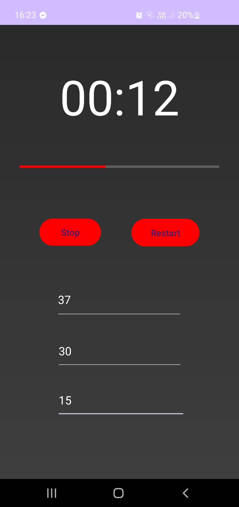
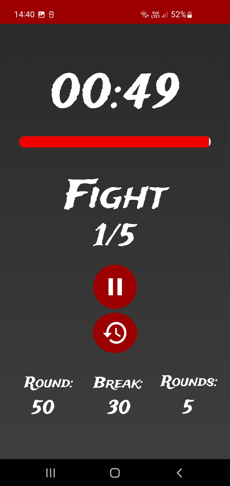
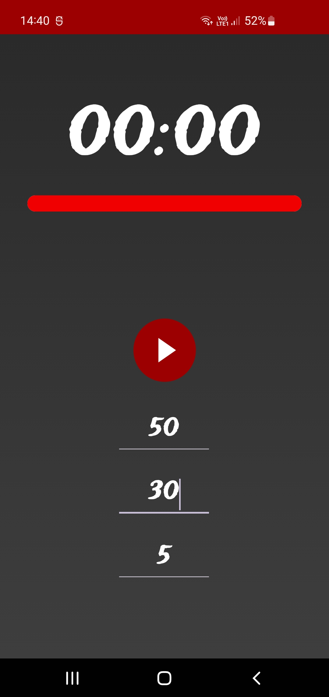

# 🥊 Boxing Timer

A simple and customizable boxing round timer app for training, sparring, or workouts.

---

## ✨ Why I made this:
- I needed exactly this type of app for timing my heavy bag workouts
- I wanted to learn from the process
- It was fun

## 📦 Features
- Adjustable round and rest durations  
- Audio cues for the start/end of rounds  
- Clean and minimal user interface  
- Designed for Android

## 🧱 Built With
- Android Studio (Kotlin/XML)

## 📈 Future Plans
- Add voice countdown
- Save preset workouts

## 🛠️ How to use it
- Set how long (in seconds) your round, break, and total number of rounds should be
- Press Start
- To change timer settings or reset the timer, press the Restart button
- To pause, press the Pause button (After pressing Start again, the current round will reset)

## Old version vs updated version:

  

  
  

## Author
- Filiprian  
- [My GitHub](https://github.com/Filiprian)
